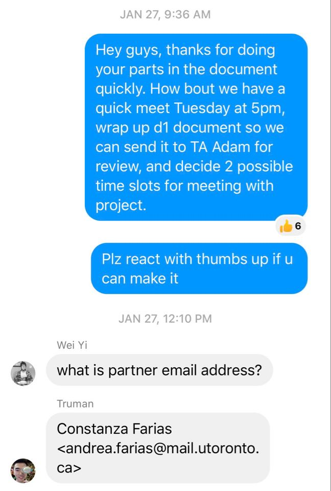

# Disability Justice Network of Ontario by Team DJNO

## Iteration 2 - Review & Retrospect

- When: March 8, 2020
- Where: BA3185 and Zoom

## Process - Reflection

After our recent review meeting, our team realized many of the decisions we made during deliverable 1 were either too idealistic and turned out to cause lots of extra work. We also had many that turned out to be much more helpful than expected. After realizing problems and good things during the second week of development, the team was quick to adapt and made a few adjustments to improve the process.

#### Decisions that turned out well

1. Weekly meetings with project partner and teammates  
   The thing turned out well and held the team together on track was the weekly meetings on Friday/Saturday. These meetings enabled us to review the progress of each member, catch up with the overall progress of the project, discuss any issues together and gave useful technical details. We also had our project partners for these meetings over Zoom, allowing us to discuss and clarify and the requirements. In addition our project partner also provided us with expertise knowledge in the disability field, which helped us better understand the issue we are solving.

2. Clever choices of communication  
   Another important decision that turned out well was the use of Facebook Messenger over Slack for everyday communication within the team (still use slack for development updates) and having everyone to check the group chat at least every 24 hours. Although Slack has features (such as channels) that causes it to be more widely used in the professional setting, it is less accessible for us (some members don’t have phones that offer the Slack app). Everyone on the team uses Messenger on a daily basis and are more likely to see new messages in our group chat. We can see members who have read a message and utilizes the thumbs up emoji as saying _agreed/understood_.

3. Paired programming  
   Although our team members have different experience, the paired programming enabled us to succeed in development because it allowed for the simultaneous coding and study of technologies. It also saved a lot of time in the long run as there is not much code to write for the actual functionalities, the real cost is the communication problem. And there was not much conflict when merging branches/repos after we implement paired programming

4. Consequence of being late  
   During the first couple of meetings, some members happen to just show up late. Therefore, we created a contract where for each meeting, the person who arrives last without any valid excuses will be responsible for providing snacks and beverages for the next meeting. This encouraged everyone to arrive on time to meetings so less time are wasted waiting and explaining the same idea multiple times.

#### Decisions that did not turn out as well as we hoped

1. Using reactJs too quickly  
   One bad decision we made was choosing to use React to build our front-end framework. We underestimated the lack of experience in our team, and that became a huge cost, so we decided to switch to static page with Bootstrap studio tech stack after our agile team meeting.

2. Asana problem  
   We tried to use Asana to manage the project progress, This did not turn out as well as we expected because our team members seems to work well without it. And we are not used to clicking a task button after they finished each task.

3. Insufficient test and automation  
   Although we tried to make a continuous integration process, We did not allocate sufficient time and resource on developing a good test framework. This caused us to miss a lot of simple bugs that all surfaced during integration and deployment. Ultimately causing member to get stuck and waiting for fixes on the server side.

#### Planned Changes

- Test framework development  
  We decided to assign a member (William for now) to lead in developing a test framework for the backend. When making changes, members must make sure the tests all pass before pushing, and make any corresponding changes to test suites related to the modified code. This way, problems can be noticed and fixed during development.

- To address the issue of code reviews, we decided that each member should take ownership of his work, and we would take 30 min to 1 hour time at the beginning of each meeting for long code reviews. This task primarily falls upon Junxuan and Truman, who will make sure both the frontend and backend parts are working accordingly.
- User **Travis** to do automation
  As mentioned in the previous not doing well part.

## Product - Review

### Goals finished

Goal1: Set up remote database and relevant services  
We managed to set up our MongoDB and services in digital ocean, and discussed the cost with our projct partner. But it seems they're not quite enthusiastic with instant support on server cost.

Goal2: providing a demo  
We managed to demo to our partner. We also showed the matching process and the rough effect in our app.

Goal3: get feedback  
Our project partner was very pleased with our progress and our level of dedication. She provided some valuable feedback on our UI, suggesting it could be more intuitive of the end-user.

### Goals not finshed well

Project partner expects the person who offer to get a request list instead of the requester  
We tend to make an opposite service according to our previous request and offer model. Project partner expects the person who offers help can choose to help instead of person who needs help chooses to get help from and they asked us to change. We'll do this in the later milestones.

## How's our demo

- we recorded some short demos on the matching algorithm to the project partner, and seems that she likes it a lot and meet her expectation.
- We managed to give a working model to the partner and they can actually update the settings to find the best mathed pairs
- The partner was very happy with our product and mentioned we made a good work
- There was a change request from our project partner as mentioned before. We're asked to reverse the offer-request model to request-offer model.
- It was a pleasant talk and we also learned about how to clearly demonstrate a product to a real user

## What we learned

- Dividing branches too much may not work and it's better to have a clear structured project

We realize that the actual procedure of our app is too singular to be divided. They're so closely related that it's hard to divide independent task to each other. Making too many branches just screw things easily in this case. So it's better if one person implements the controller layer and one person implements the service layer. This not only reduces branches and later conflicts, but also makes our duties clear. A MVC structure would be quite enough

- Importance of paired programming and improving together

Different team members have different experience, it's hard to distribute work to individuals since we cannot accurately expect how much our members can do. So paired programming and discussing of new technical details can solve this issue.

- Possible security issues

During the meetings with our project partner, we learned a lot about security, possible malicious users and the way to resolve them

## What we expect most

- Our next step is to finish the chat room functionality s.t people can really be connected together. And there're also some additional features like we can make people using the app watch live stream together.
- Also we want to improve the overall quality of our project, we'll inplant automation into our project. We'll try to automate the commit process and the testing process, making sure later we can achieve a test-driven development. A test-driven development environment can help us have safer and better progress.
